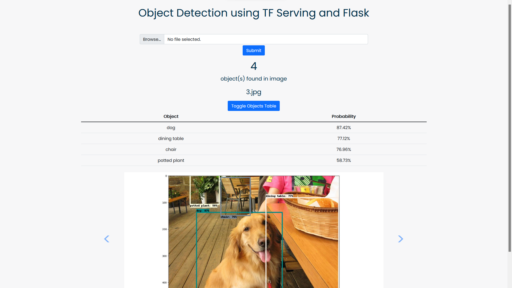

# Object Detection using Flask, TensorFlow Serving and Docker

Implements a web app to which images can be uploaded. A TensorFlow model is then used to perform object detection. The model is served through TensorFlow Serving. The web app and the TF-Serving server is packaged using Docker. Docker-compose is used to create a virtual network for both container such that the Flask app can access the TF Serving container (in this case via REST).

## Directory structure:

- root
  - .env
    - Defines several environment variables that are used within the docker-compose file and the web app
  - docker-compose.yml
    - Defines the services (Flask web app + TF Serving) such that they are run together. Utilises the GPU ([prerequisites](https://docs.docker.com/config/containers/resource_constraints/#gpu)).
  - docker-compose_CPU.yml
    - Same as the file above but doesn't utilise the GPU (and, therefore, also doesn't require any extra prerequisites).
- flask_app
  - Contains the Flask web app along with the respective Dockerfile.
- models
  - Contains a TensorFlow model from the TensorFlow object detection [model zoo](https://github.com/tensorflow/models/blob/master/research/object_detection/g3doc/tf2_detection_zoo.md).  [EfficientDet D4](http://download.tensorflow.org/models/object_detection/tf2/20200711/efficientdet_d4_coco17_tpu-32.tar.gz) is used for this project.

## Run

To run the entire app, type (in the same directory as this README file):

```
sudo docker-compose up
```

Wait a few seconds until both containers are spun up. Then visit `localhost:8500` to view the app.

To use the app select a valid image (.jpg, .jpeg, .png) and hit "Submit". The result will be displayed within a few seconds. 

## Screenshot



